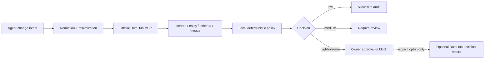

# Dollar Data Context Guard

> A new, Apache-2.0-licensed DataHub project that turns an AI agent's proposed data change into a traceable, metadata-aware safety decision.

Dollar Data Context Guard (DCG) resolves an intended change through the official DataHub MCP server, reads the asset's ownership, classifications, schema, and downstream lineage, then applies a **local deterministic policy**. It can allow a routine metadata update, require review, require owner approval, or block a destructive production change pending human approval.

This repository is a standalone Build with DataHub submission created during the event period. It contains no Dollar Steam source code, desktop binaries, local hooks, user data, API keys, or production catalog data.

## The problem

Coding agents can propose a command like “drop `email` from `commerce.customer_profile`.” A command-level rule can see the destructive operation, but not whether the field is classified PII, who owns it, or whether a retention dashboard and churn model depend on it.

DCG supplies that missing organizational context before a change is allowed to proceed.

## What works today

- DataHub MCP adapter that uses `search`, `get_entities`, `list_schema_fields`, and `get_lineage` at runtime.
- Synthetic, clearly labelled retail catalog demo for local, zero-credential evaluation.
- Data minimization and redaction before any metadata query.
- Deterministic decision engine: the LLM is not a safety authority and cannot author arbitrary commands.
- Asset owners, classifications, affected fields, and three-hop downstream lineage in one review surface.
- Write-back is disabled by default and requires an explicit human approval plus a separately enabled DataHub mutation capability.
- Unit tests for redaction, policy decisions, unresolved assets, and write-back consent.

## Three-minute judge path

### Fast fixture path

```powershell
git clone https://github.com/junsenliu/dollar-datahub-context-guard-2026.git
Set-Location dollar-datahub-context-guard-2026
npm.cmd test
npm.cmd run demo
```

Open `http://127.0.0.1:4310`, keep **Drop the production email field** selected, then click **Analyze intent**.

Expected result: `EXTREME · block pending owner approval` because the synthetic `commerce.customer_profile` asset is PII-tagged, production-scoped, and has three downstream dependents.

### Verified live DataHub MCP path

For a real self-hosted DataHub Core catalog through the official MCP server, follow [`LIVE_WEB_DEMO.md`](LIVE_WEB_DEMO.md). The tested runtime, tool list, synthetic catalog evidence, and expected three-hop result are recorded in [`LIVE_VERIFICATION_2026-07-31.md`](LIVE_VERIFICATION_2026-07-31.md).

## Architecture



## DataHub MCP integration

DCG contains a dependency-free JSON-RPC stdio client in [`src/mcp/mcp-stdio-client.mjs`](src/mcp/mcp-stdio-client.mjs). In `DCG_MODE=mcp`, it launches the official MCP package and invokes DataHub tools at runtime:

| Tool | DCG use |
| --- | --- |
| `search` | Resolve a human or agent-supplied asset query to a DataHub URN. |
| `get_entities` | Read ownership, platform, descriptions, and classifications. |
| `list_schema_fields` | Inspect only the field contract relevant to the requested change. |
| `get_lineage` | Measure downstream impact through up to three hops. |

The official DataHub MCP server documents these tools and its metadata/lineage purpose at [acryldata/mcp-server-datahub](https://github.com/acryldata/mcp-server-datahub). The package is launched by default with the officially documented command pattern:

```powershell
uvx mcp-server-datahub@latest
```

### Connect a real DataHub environment

The demo intentionally defaults to `fixture` mode. To use a real catalog, configure the official DataHub MCP server for an environment you are authorized to access, then provide the command and its environment variables locally. Never commit credentials.

```powershell
$env:DCG_MODE = 'mcp'
$env:DATAHUB_GMS_URL = 'http://localhost:8080'
$env:DATAHUB_GMS_TOKEN = '<your-local-token>'
$env:DATAHUB_MCP_COMMAND = 'uvx.exe'
$env:DATAHUB_MCP_ARGS = '["mcp-server-datahub@latest"]'
npm.cmd run inspect:mcp -- --mcp
npm.cmd run demo
```

`inspect:mcp` exposes the live server's tool definitions before any analysis. By default DCG issues only read requests. A future write-back path calls `save_document` only when both the MCP server supports mutations and a human explicitly approves the decision record.

## Privacy and safety boundaries

| Sent to DataHub | Never sent by DCG |
| --- | --- |
| Minimized asset query, asset URN, and metadata lookup parameters | Source files, local command transcripts, API keys, secret values, user home paths |

DCG is not a replacement for data-platform access control, DataHub permissions, an agent sandbox, change management, or human review. It provides an additional context and decision layer.

## Local development

This project uses only Node.js built-ins for its demo and test path.

```powershell
npm.cmd run check
npm.cmd test
npm.cmd run analyze
npm.cmd run demo
```

Available local scenarios:

- `destructive-customer-email` — an extreme production PII change with downstream lineage.
- `safe-product-description` — a low-risk documentation update.

You can also provide a minimized intent JSON file:

```powershell
node src/cli.mjs --intent .\examples\intent.json
```

## Project structure

```text
src/
  guard-service.mjs        # Orchestration and explicit write-back gate
  policy-engine.mjs        # Local deterministic classification
  redaction.mjs            # Secret and home-path redaction
  mcp/                     # Official DataHub MCP stdio adapter + local fixture adapter
  fixtures/                # Synthetic metadata only
public/                    # Standalone judge demo interface
test/                      # Node test suite
```

## Build with DataHub disclosure

Dollar is an existing local-first Windows product. This standalone repository is a new DataHub competition module, not a re-upload of Dollar:

- New work in this repository: DataHub MCP client, change-intent schema, metadata-context orchestration, deterministic context policy, synthetic demo catalog, browser demo, tests, and documentation.
- Pre-existing product inspiration only: Dollar's general principle that people should understand risky agent work before it runs.
- Not included: Dollar Steam source code, Electron UI, local hooks, approvals, snapshots, rollback, customer data, and production telemetry.

## License

Copyright 2026 LinkSea LLC. Licensed under [Apache-2.0](LICENSE).
